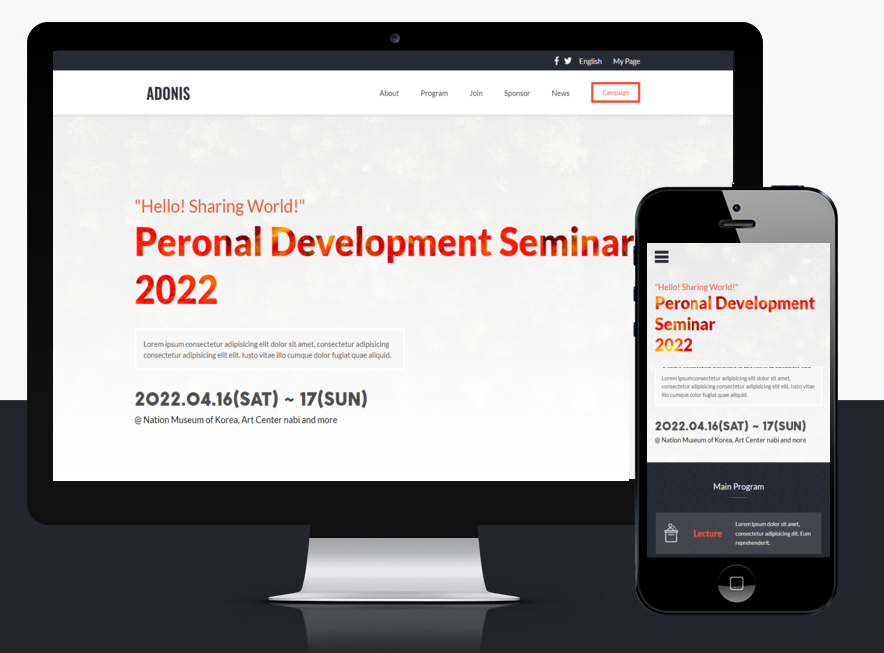

# Seminar - Capstone Project

> This is a clone of a creative commons seminar webpage and consists of two pages, both fully responsive for desktop and mobile phones.

It contains two pages:
- Home
- About

Each Page has the following sections:
1. Header
2. Title section
3. Mid Section
4. Footer

## Built With

- HTML
- CSS
- javaScript

## Live Demo
[Live Demo Link](https://jasonfelice.github.io/First-Capstone/)

To get a local copy up and running follow these simple example steps.
- Copy this [link](https://github.com/jasonfelice/First-Capstone)
- Open the terminal
- Run "git clone" and paste the link
- Open this folder in your code editor
- Create a feature branch to work on
- Now you can edit and make a pull request

## Authors

👤 **Jake Felice**

- GitHub: [@jasonfelice](https://github.com/jasonfelice)
- LinkedIn: [LinkedIn](https://www.linkedin.com/in/jake-felice/)
- Twitter: [@jasonfelice0](https://twitter.com/jasonfelice0)

## 🤝 Contributing

Contributions, issues, and feature requests are welcome!

Feel free to check the [issues page](../../issues/).

## Attributions
- I have used Creative Commons design under [this](https://creativecommons.org/licenses/by-nc/4.0/legalcode) licence. Original design idea by [Cindy Shin in Behance](https://www.behance.net/adagio07).
- Facebook icons created by [Freepik](https://www.flaticon.com/free-icons/facebook) - Flaticon
- Twitter icons created by [Pixel perfect](https://www.flaticon.com/free-icons/twitter) - Flaticon

## Acknowledgments

- Hat tip to anyone whose code was used
- Inspiration
- etc

## 📝 License

This project is [MIT](./MIT.md) licensed.
